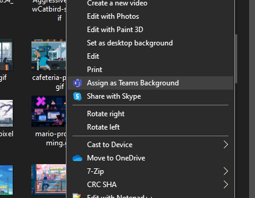

# Teams Background Changer

## Introduction
This project started as a way to add animated backgrounds to **Microsoft Teams**. By default you cannot just pick a *.gif* file and use it directly, so after reading some posts like this one:

https://rogierdijkman.medium.com/microsoft-teams-animated-backgrounds-b457ee38d50d

I decided to create this silly app to update these backgrounds quickly.

To summarize, the process simply involves renaming your animated *.gif* file to *.png*, and uploading it together with a *thumbnail* copy to a specific **Teams** folder, so this is what the app does. 😎

I have only tested it in Windows 10... the code *should* work for MacOS as well but haven't tested it.

I didn't find a way to automate the full process since I cannot figure out where the background image information is stored, so there's a little manual thing you have to do only once and that's it:

- In the settings file you'll find an entry for the image prefix (by default *background-changer*). This means that upon running the app it will create *background-changer.png* and *background-changer_thumb.png* files in the destination folder.

- Once you run the app for the first time, or if you do the process manually, simply open up your **Teams** application and choose this newly specified background.

From now on, every time you run the app it will replace *background-changer.** files with new ones, so will effectively change the wallpaper. Just run it before a new call and you'll be ok.

Also, if you're sharing your camera when running the app the process will not work; simply deactivate it and run it again.

As usual full source is provided so feel free to modify and do whatever you want with it.

If you like this, you can also [buy me a beer](https://www.paypal.me/gamosoft) 😉

## Installation
Just modify your *appsettings.json* file prior to executing the app.

```json
{
  "ImageConfig": {
    "TeamsImagePrefix": "background-changer",
    "SourceFolder": "C:\\teams-backgrounds",
    "SourceExtensions": [ ".gif", ".jpg", ".png" ]
  }
}
```

You should change these values:

- **TeamsImagePrefix**: The prefix of the image files that will be written to the Teams user backgrounds folder
- **SourceFolder**: A folder that contains images to be applied as backgrounds (animated or not)
- **SourceExtensions**: Collection of allowed image extensions to be processed. Most likely *gif* for animated backgrounds, but also *jpg* and *png* (basically whatever is supported by Teams OOB)

As mentioned, run the app once, then open up **Teams** and choose the newly setup background.

When you re-run the app, it will choose a different background and apply it.

## Context menu
Only for Windows, I have also created a registry file that allows you to set an image file as **Teams** background without having to open the settings menu, etc...

Just install the provided *teams-background-shell.reg* file by doucle-clicking on it, it's just a basic **Powershell** script that copies the files into the desired location. They are copied with the names *background-changer.png* and *background-changer_thumb.png* to be in sync with the above specified settings. If for some reason you want to change these names it's very easy to edit the *.reg* file and put whatever you want.

Onve you have it installed, just right-click on an image file and you'll see a popup like this one:



Same restrictions apply, that is, if you run it while sharing your camera it won't work.

Hope you enjoy it!
